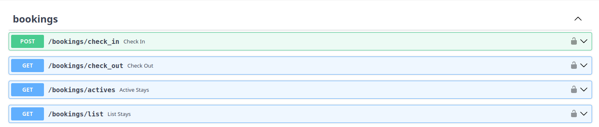
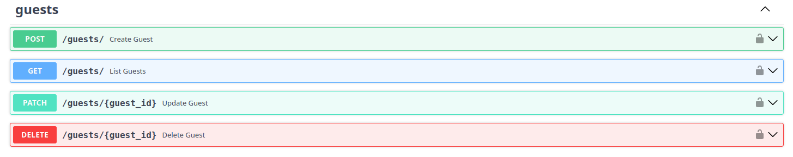
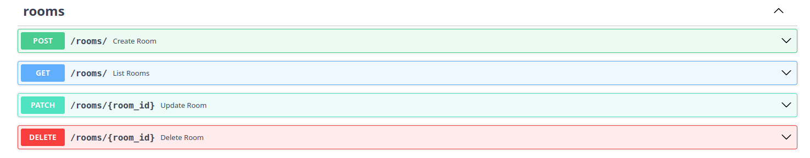
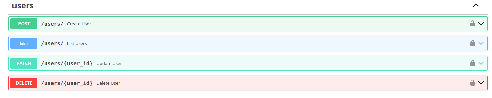
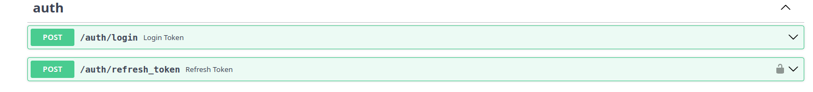

# HotelManager

## Overview

**HotelManager** is a robust backend API designed to streamline hotel operations. Its main intent is to **simplify the management of rooms, guests, and bookings** by providing a centralized, asynchronous system. It solves the problem of manual tracking and data inconsistency, ensuring real-time availability and efficient reservation handling.

## Features

The core functionalities implemented in the project include:

* **Room Management:** Create, update, and delete room listings with details such as room type, price, and amenities.
* **Reservation System:** Handle guest bookings, check-ins, and check-outs with conflict detection to prevent double-booking.
* **Guest Directory:** Maintain a secure database of guest information and history.
* **Asynchronous Database Access:** Utilizes non-blocking database operations for high performance under load.
* **Schema Migrations:** Automated database schema management using Alembic.

## Tech Stack

The project was built using **Python and FastAPI**. The key libraries and tools include:

* **SQLAlchemy:** For ORM-based database interactions.
* **Alembic:** For handling database migrations.
* **aiosqlite:** For asynchronous SQLite database support.
* **Pydantic:** For data validation and settings management.
* **Uvicorn:** An ASGI web server implementation.

## Images











## Installation and Setup

Follow these steps to get the project running locally. Assume you have **Python 3.8+** installed.

1. **Clone the repository:**

    ```bash
    git clone https://github.com/JoaoPedroHenriquesB/HotelManager.git](https://github.com/JoaoPedroHenriquesB/HotelManager.git
    cd HotelManager
    ```

2. **Create and activate a virtual environment using `uv`:**

    ```bash
    uv venv
    # On Windows:
    .venv\Scripts\activate
    # On macOS/Linux:
    source .venv/bin/activate
    ```

3. **Install dependencies:**

    ```bash
    uv sync
    ```

4. **Apply database migrations:**

    ```bash
    alembic upgrade head
    ```

5. **Run the application:**

    Execute the "main.py" file in the project's root directory to start the API.
